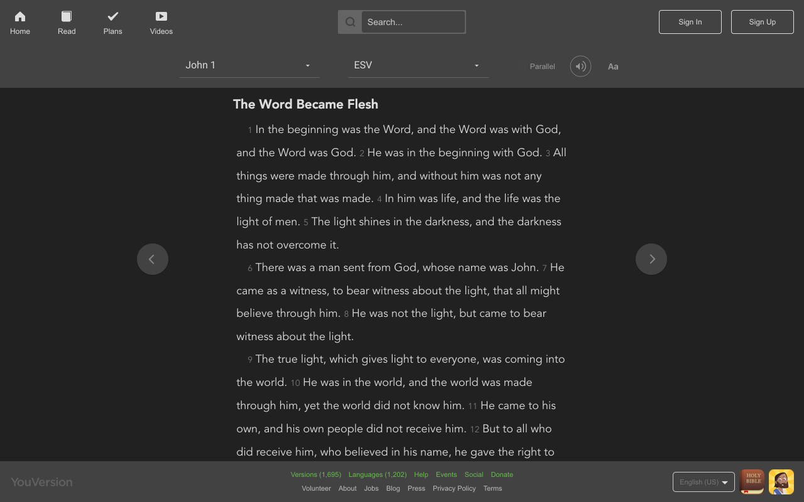

# Night Mode Bible

A simple chrome extension to make [bible.com](https://bible.com) dark for easier reading at night.

## Installation

Get it from the [Chrome Web Store](https://chrome.google.com/webstore/detail/night-mode-bible/ebiieffikaglhelcnogmmijmlejdhngk).

## Todo - Contributions welcome!

* [ ] New icon
* [ ] Ability to enable/disable based on time
* [x] Option to toggle the extension on/off

# Developing

* Clone the repo
* Add to Chrome by going to `chrome://extensions`
* If need be, check the `Developer Mode` box
* Hit the `Load Unpacked Extension` button
* Select the `extension` folder in the cloned repo
* Make some awesome changes to the source
* Reload the `chrome://extensions` page to load your changes
* Push to Github and make a pull request :)
